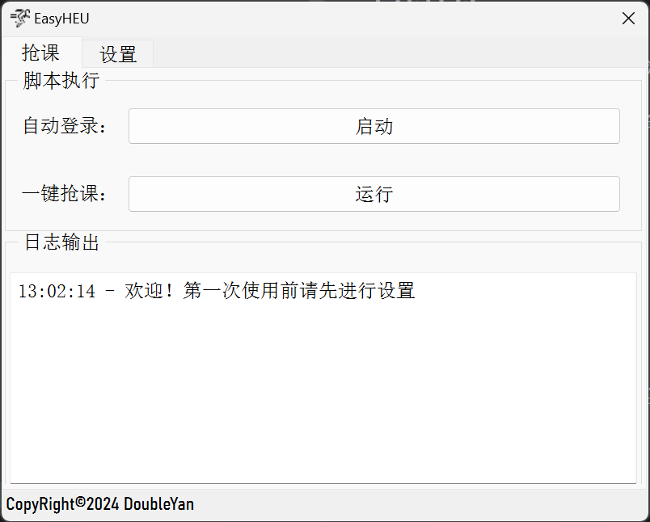
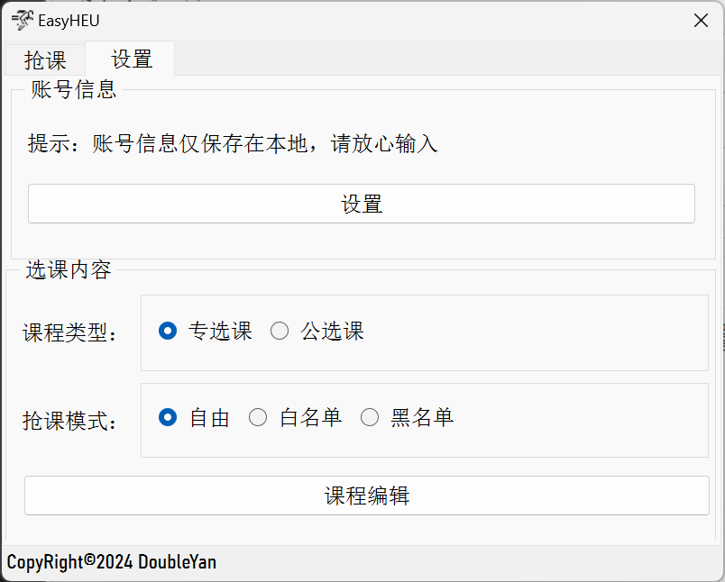

# EasyHEU - 贡🍊自动抢课小工具

EasyHEU 是一个用于自动抢课的 Python 工具，旨在帮助HEU的学生更便捷地进行课程选择。该工具使用 Selenium 进行自动化操作，使用 PyQt5 构建图形用户界面。

## 功能特性

- **一键登录：** 允许用户一键完成免验证码登录。
- **自动抢课：** 提供一键式抢课功能，支持选择专选课或公选课。
- **名单模式：** 支持黑名单模式和白名单模式，用户可根据需求选择适合的模式。

## 界面




## 开始使用

### 环境

确保你的环境中已经安装了 Python 和以下依赖：

- `selenium`
- `PyQt5`
- `ddddocr`

### 安装

克隆项目并进入项目目录：

```bash
git clone https://github.com/你的用户名/EasyHEU.git
cd EasyHEU
```

运行主程序：

```bash
python main.py
```

### 使用说明

1. 在图形界面中设置登录信息，包括学号、密码等。
2. 选择课程类型和抢课模式。
3. 点击 ”启动“ 按钮，工具将自动登录并打开选课页面。
4. 点击 "运行" 按钮，工具将自动进行抢课操作。

## 贡献

欢迎各种形式的贡献！如果你发现了 bug、有新功能的想法或者改进建议，请提交 issue 或者直接提出 Pull Request。

## 版本控制

EasyHEU 遵循语义化版本规范。查看[版本更新日志](CHANGELOG.md)以获取详细信息。

## 许可证

EasyHEU 采用 MIT 许可证。详细信息请参阅 [LICENSE](LICENSE) 文件。

## 鸣谢

感谢所有为该项目做出贡献的人。在[贡献者列表](CONTRIBUTORS.md)中查看更多信息。

## 联系方式

在使用过程中遇到问题或有其他需求，请通过 [GitHub Issues](https://github.com/你的用户名/EasyHEU/issues) 进行反馈。

希望 EasyHEU 能帮助到你，也欢迎大家共同完善该工具，让我们共同进步！